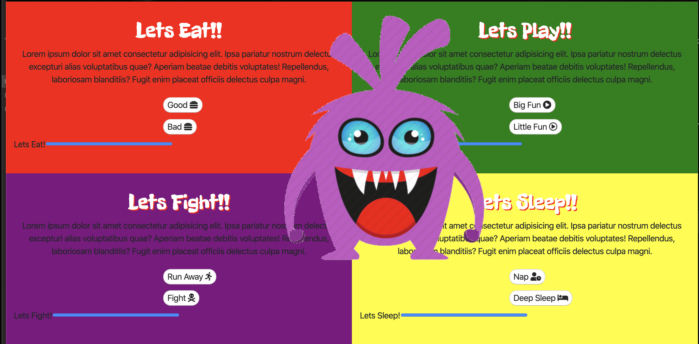

# Tamagotchi

Basic 8-bit game

## Description

Basic game application used to entertain and amuse. The object is to take care of a small digital creature

## Technology Used

## Screenshots

## How to deploy

* Clone down this project
* Install[ http-server](https://www.npmjs.com/)
from npm
\* At the root of this project run the following command `npm start`;

\* In your browser navigate to `http://localhost:8888`

# Contributors
Kenny Mc
